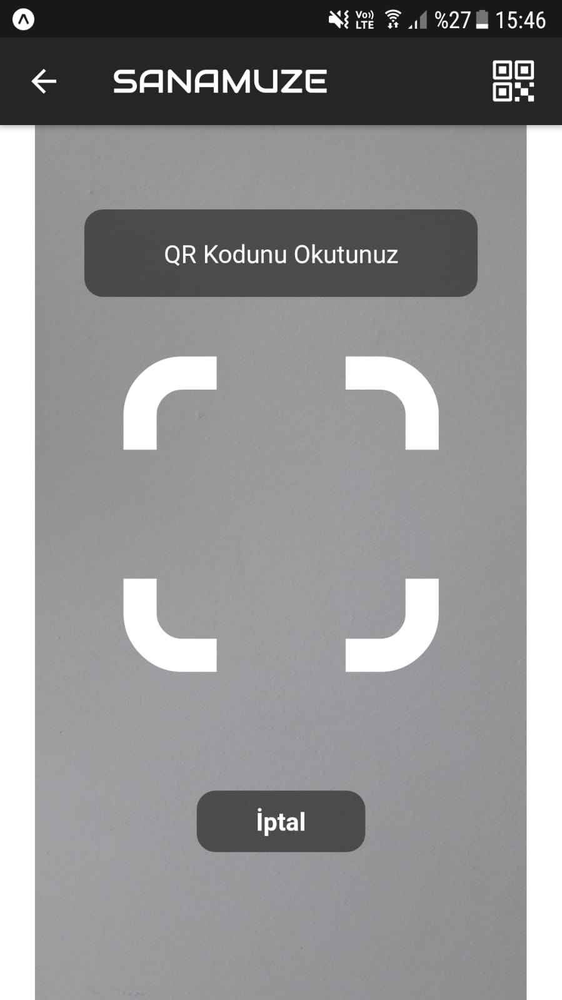
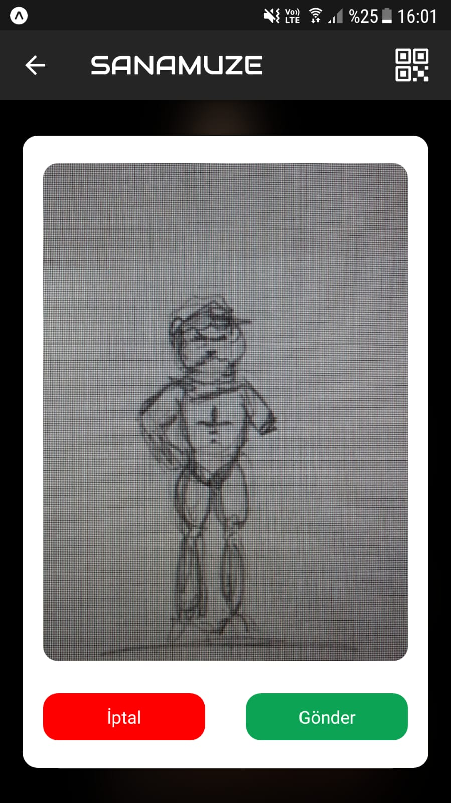

# SanAmuze Mobile App

This is a SanAmuze mobile app. You can compare two photos and get the similarity rate.

        

## Getting Started

These instructions will get you a copy of the project up and running on your local machine for development and testing purposes. If you want to make a change, please use the **develop** branch and open a pull request.

### Prerequisites

The things you will need in order to use the app and how to install them.

- [Node 12 LTS or greater installed](https://nodejs.org/en/download/)
- [Expo CLI](https://docs.expo.dev/workflow/expo-cli/)

### How to use
First you need to download project.
```
git clone https://github.com/teknofest-2021/sanamuze-mobile-app.git
```
After you build you can install dependencies.
```
cd sanamuze-mobile-app
npm install
```
Now you can start app
```
expo start  # you can also use: npm start
```

## Built with

* [React Native](https://reactnative.dev/) - The programming language used
* [Python](https://github.com/teknofest-2021/similarity-rate-api) - The backend API
* No external libraries were used in this project

## Authors

* **Fehmi Şener** - [Github](https://github.com/fehmiisener)
* **Ramazan Kaan Yarayan** - [Github](https://github.com/rknyryn)

See also the list of [contributors](https://github.com/teknofest-2021/sanamuze-mobile-app/contributors) who participated in this project.

## Acknowledgments

* Dear Teachers
* Teknofest Executives
* All Team Members
